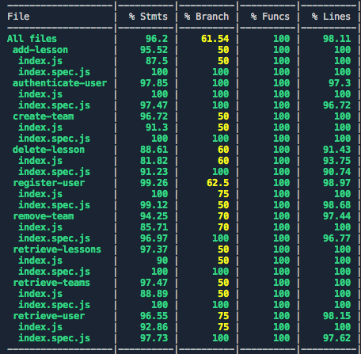
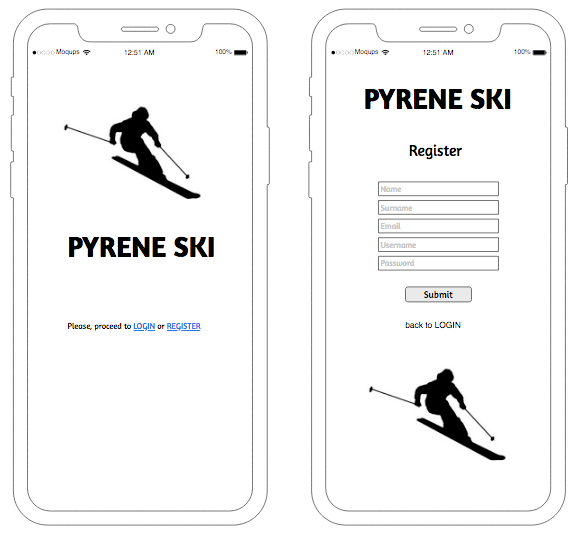
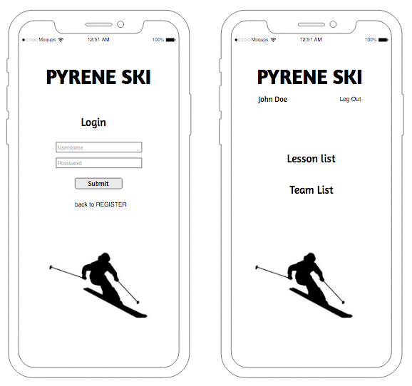
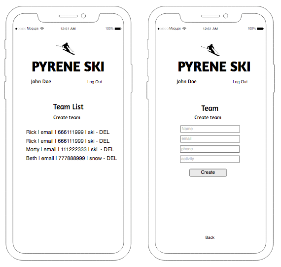
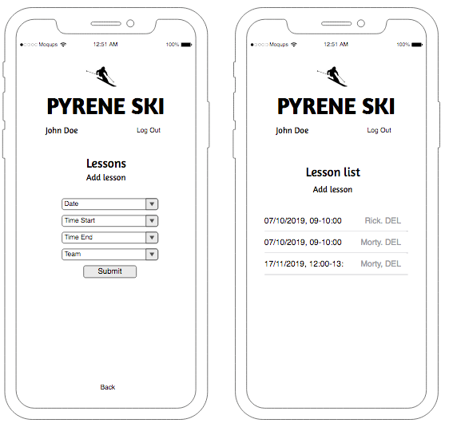
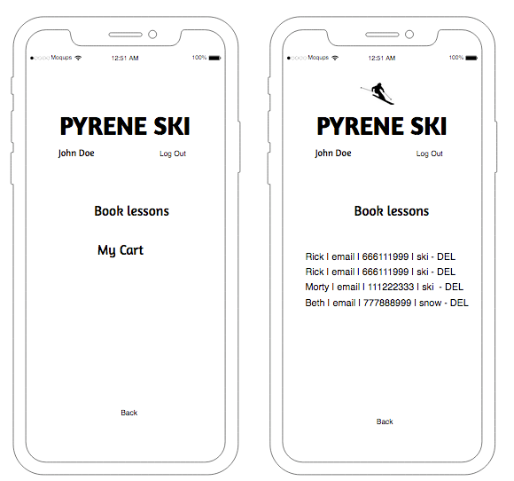

# PYRENE-SKI 

## Introduction and motivation:

The Pyrene Ski App is a web tool tu be used by a school of ski. It allows an administrator account to create teams (teachers) and ski lessons, setting dates, shedules and activities. Lessons are offered to registered clients accounts to be booked online. This app come up to cover a real need of a school and club of ski, 'Club d’Esquí Pyrene' , http://clubesquipyrene.com/ , established in the Catalan Pyrenes. 

The name 'Pyrene' is related to various female characters of Greek and Iberian mythology.

## Functional Description

Admin can: 

- login and authenticate as administrators
- create teams
- list teams
- create lessons linked with teams
- retrieve lessons
- list lessons

Client can:

- register themselves as clients
- login and authenticate as clients
- list lessons

### Use Cases

### Activity Diagram

## Technical Description:

### Blocks

### Components

### Data Model

### Code Coverage

## Mockup Screenshots

## App Screeenshots

## Technologies

Javascript, ReactJS, Node,js, MongoDB & Mongoose

## TODO

01. Strenghth API test.
02. Strength APP test.
03. Team delete feature.
04. Client feature to book a lesson.
05. Client feature to pay a booked lesson. 
06. Calendat implementation.

## Credits

Aitor Parra Bellón
Github Aitor1979