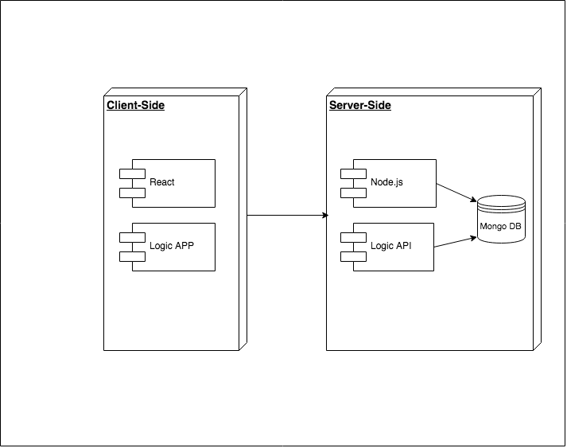
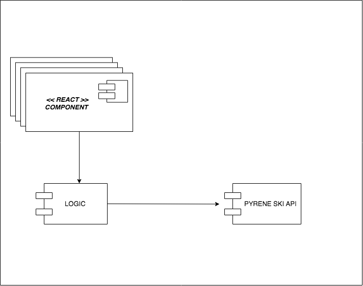

# PYRENE-SKI APP

## Introduction:

The Pyrene Ski App is a web tool tu be used by a school of ski. It allows an administrator account to create teams (teachers) and ski lessons, setting dates, shedules and activities. Lessons are offered to registered clients accounts to be booked online. This app come up to cover a real need from a school and club of ski, Club d’Esquí Pyrene , http://clubesquipyrene.com/ , established in the Catalan Pyrenes. 

## Functional Description

### Use Cases

### Activity Diagram

## Technical Description:

### Blocks

### Components

### Data Model

### Code Coverage

### Mockup Screenshots

### App Screeenshots

## Future Version Features

01.Client feature to select date/time to a corresponding team member on calendar.
02.Client feature to pay for the selection. 