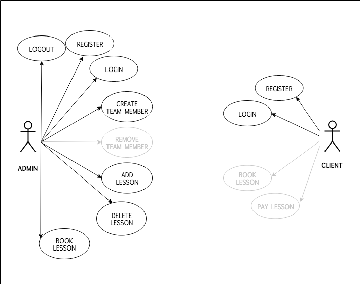

# PYRENE-SKI

## Introduction:

The Pyrene Ski App is a web tool for a club and school of ski that manage ski classes bookings from clients and the avaibality of ski teachers all through a main calendar. The club administrator can insert lesson times related to teachers in the calendar, and outside clients can search for a specific schedule and teacher in the same calendar, being able to book and pay for that teacher and lesson.

## Functional Description

### Use Cases

### Activity Diagram

## Technical Description:

### Blocks

### Components

### Data Model

### Code Coverage

### Screenshots

