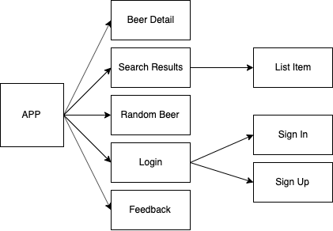

# SkyBeer Codersvjenkljnf..

## Description

SkyBeer Codersvjenkljnf.. is a team project developed for SkylabCoders bootcamp, as the endpoint of frontend part.
It has been designed as a Single Page Application that provides data (beers) from an API about official PUNK beers.
Beers can be shown by different categories or by free search and each one can be reproduced via API and stored as favorite in user data object, being necessary to be logged in order to save it. API's connections have been managed using calls. 

## Functional Description

At SkyBeer app, user can search beers in the Punk IPA API, searching them by name or using ABV, IBU, EBC filters.

User can also see the beers detailed information, as description, ingredients, levels, and maridage suggestion.

In addition, user can create a personal account and log-in. When logged, user can add favorite beers and rate them.

### Use Cases

User can Log-in/log-out, Register, Search by name, Search by filters and see beers detail.

### Activities

## Technical Description

Technologies used =>
    - HTML
    - CSS / SASS
    - Javascript
    - React 
    - AJAX

### Blocks

### Components

### Data Model

### TODO

 - Add friends with similar beer favorites
 - Add comments to beers
 - User Page, to handle update data, change password, see friends...
 - Improve the fresh information from API
