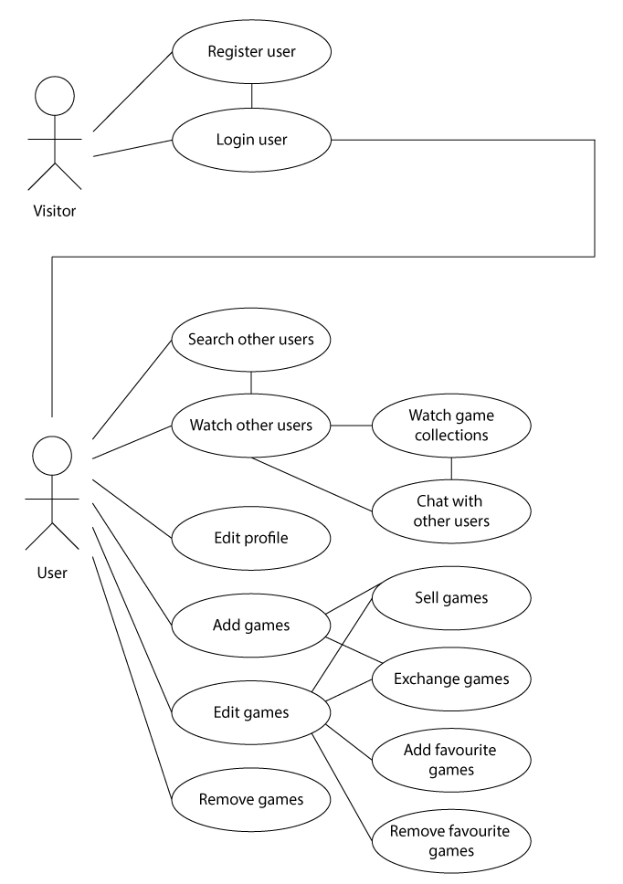
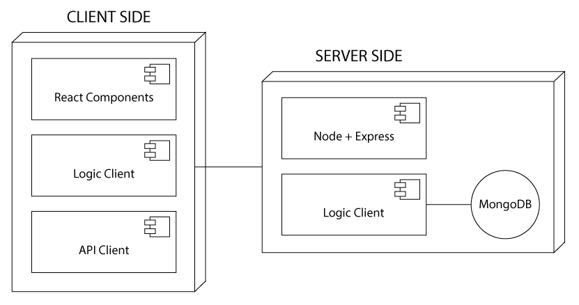
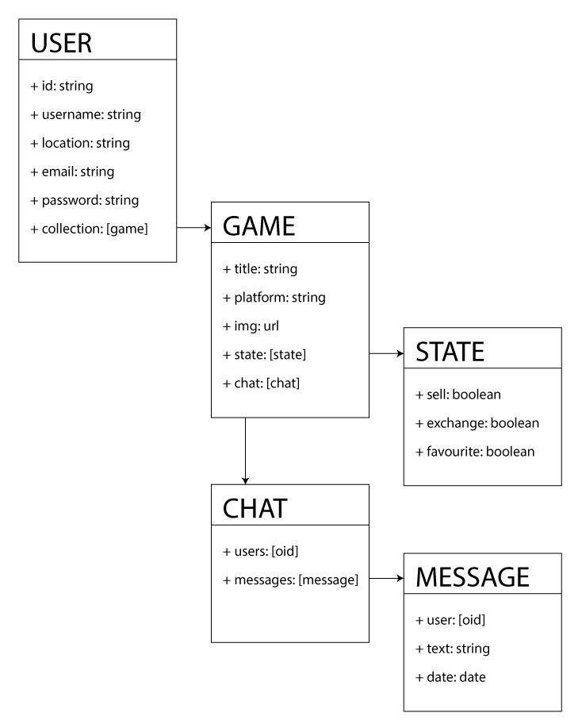
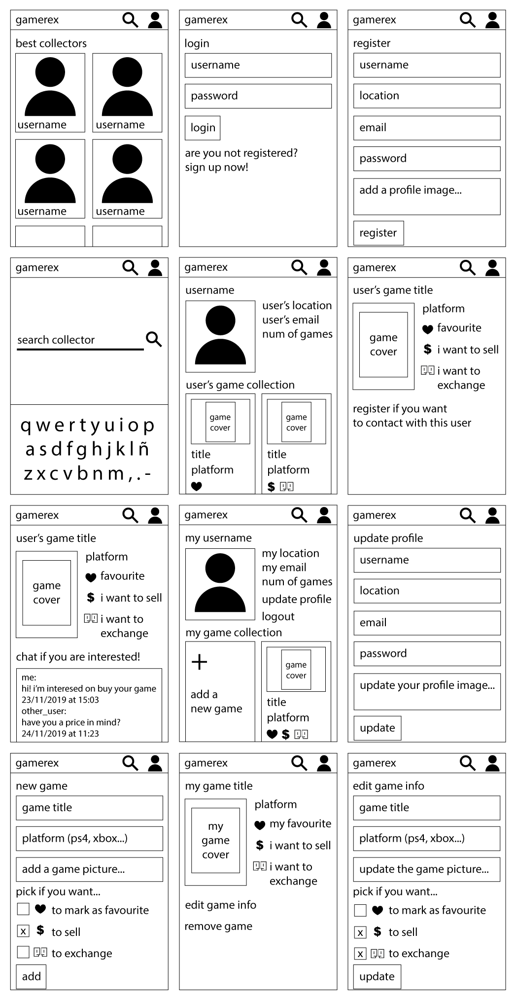
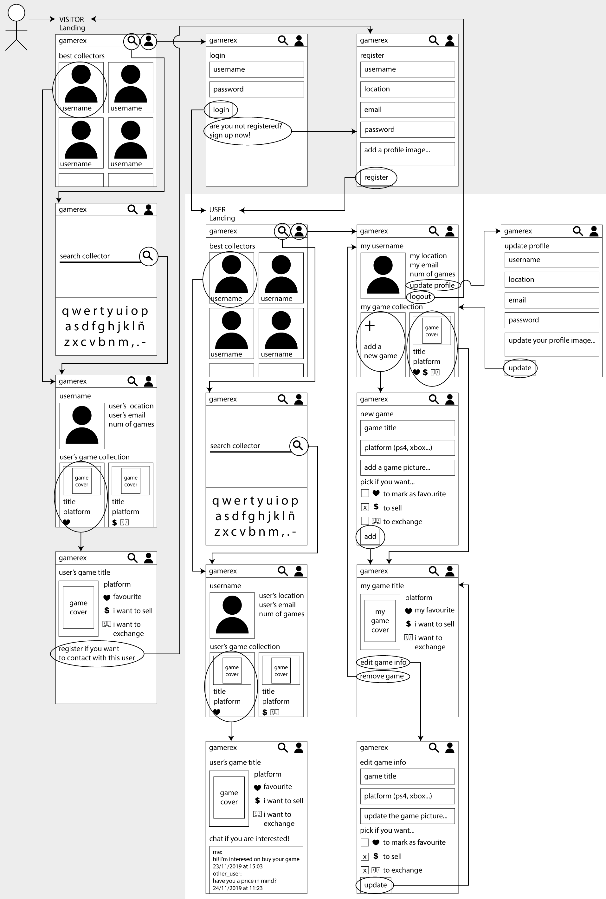

## Intro

**Gamerex** is an app where the gamers can show and share their videogame collections. Not only they can brag about their collections, also they can exchange or sell their games to other users. 

***Gamerex** es una app donde los gamers pueden enseñar y compartir su colección de videojuegos. Además de presumir de colección, podrán intercambiar o vender sus juegos a otros usuarios.*

## Functional Description

The users can:
- Register as users (obviously)
- Update their profile information
- Add or update an image for their profiles
- Add games to his collection
- Update or change the information or the selling and exchange options about the games they have
- Update photos of the game they have
- Mark their favourite games
- Mark the games they want to sell or exchange with other users
- Contact with other users about the games they want

### Use Cases

## Technical Description

### Blocks

### Data Model

## Wireframes

### Navigation

## Technologies

HTML, CSS, Javascript, ReactJS, Node.js, Express and MongoDB.