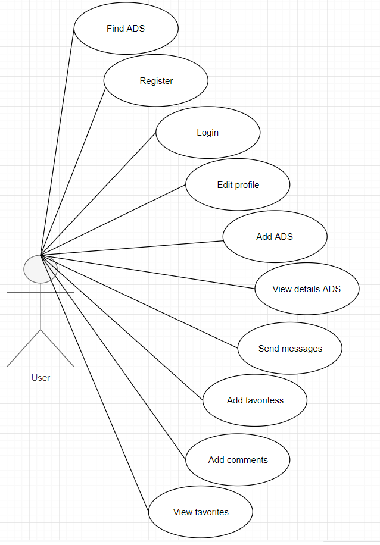
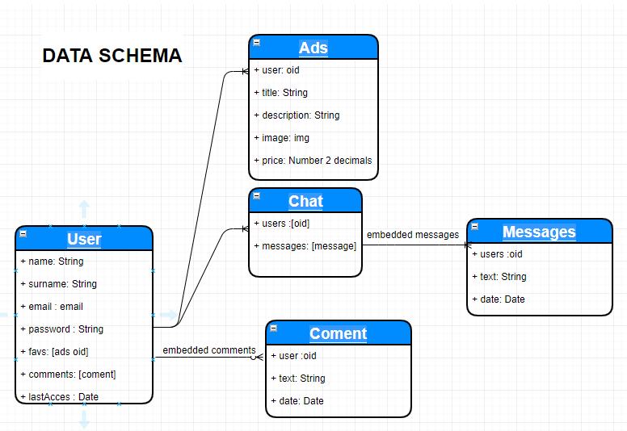
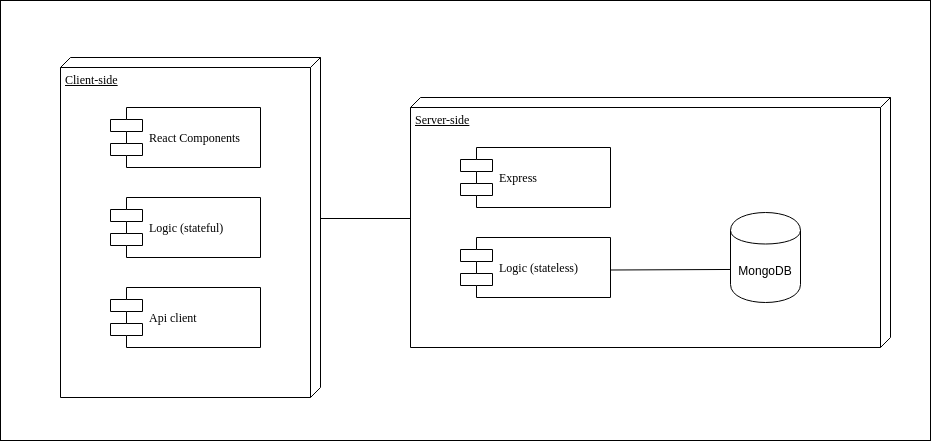
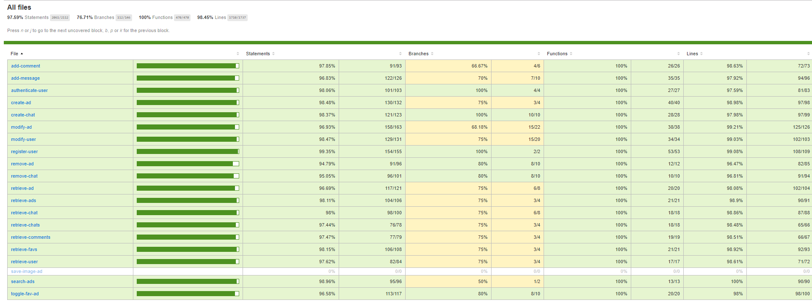

# SkillPOP

SkillPOP is a web application where you can find people who offer their skills such as:

- Teaching - Languages, music, math, sports
- Mini jobs - household filers, renovations, babysitting
- sports - soccer player, paddle player, basketball player

## Functional Description

1. #### Once the user enters our web app, he can do the following(**LANDING Component**):

    #### Ad searches

    1. It will show all the ads that match the query entered by the search bar.
    2. will show ads by proximity to your location
    3. You can enter the details of the anucnios.

        3.1 You can visit the profile of the ad user.

    #### Go to menu
    1. Login
        - Enter your email, password.
        - Return to Landing.

    2. Register
        - Enter the name, surname, email, password. 
        - Return to Landing.

2. #### Once the user is logged into our web app, they can do the following((**LANDING Component**):

    #### Ad searches
    1. It will show all the ads that match the query entered by the search bar.
    2. will show ads by proximity to your location.
    3. Go to details ads(**DETAIL ADS Component**).
        - Go to public profile User(**PUBLIC PROFILE Component**).
        - Write messages to the user of the ad(**MESSAGE DETAIL Component**).
        - Return to Landing

    #### Mark favorite ads

    #### Go to menu
    1. Go to my profile(**PROFILE Component**).
        - Edit profile.
        - View my ads
        - Go to details ads(**DETAIL ADS Component**).
        - Delete my ads
        - Return Landing.
    2. Go to favorites ads(**FAVORITES Component**)
        - View favorites ads.
        - Go to details ads(**DETAIL ADS Component**).
        - Return Landing.
    3. Go to Messages(**MESSAGES Component**)
        - View Messages
        - Go to detail Messages(**DETAIL MESSAGES Component**).
        - Return Landing.
    4. Go to public profile(**PUBLIC PROFILE Component**).
        - View ads
        - Go to detail Messages(**DETAIL MESSAGES Component**).
        - View comments
        - Return Landing
    5. Go to new ads(**NEW ADS Component**).
        - add ads form
        - Return Landing

    #### Component functionality no describes above

    1. Ads detail.
        - Go to public profile User(**PUBLIC PROFILE Component**).
        - Write messages to the user of the ad(**MESSAGE DETAIL Component**).
        - Return to page called(Landing, Public profile, Favorites)
    2. Messages detail.
        - Chat box
        - Chat message box
        - Return to page called(Messages, Detail)

### Use Cases

Below are all the use cases that a user can perform.

## Technical description
### Data Model

### Blocks

### Components

### Code Coverage

### Technologies

Javascript, ReactJS, Node.js, Express, MongoDB, Mongoose, SASS. Testing: Jest & Mocha/Chai

