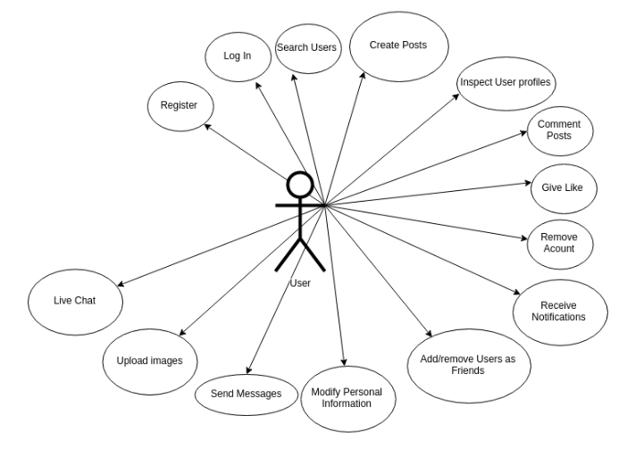
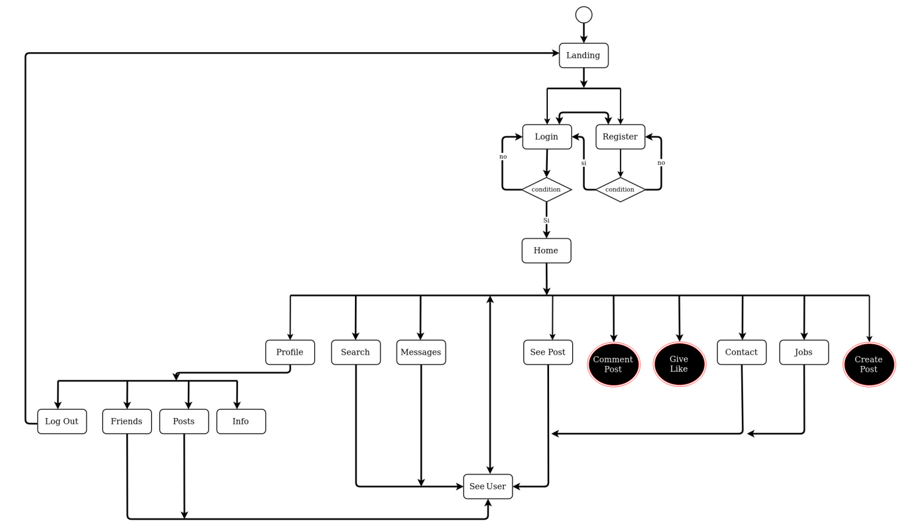
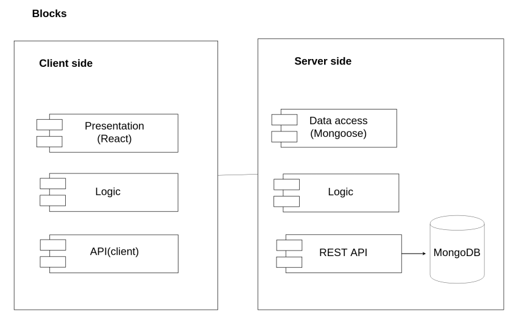
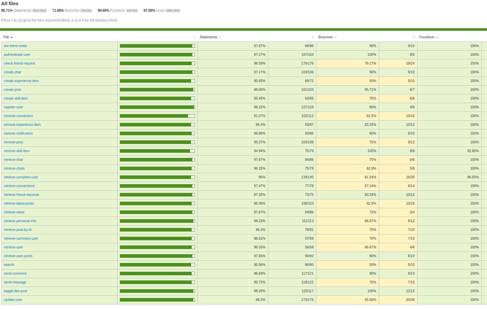

# 

A project by:
*Martín García*

## Introduction

Theatera is a social networking site designed specifically for the audiovisual community. The goal of the site is to allow registered members and companies to establish connections.

## Functional description

Here are some of the basic features that this audiovisual network offers and how they've been designed.

 * Home: Once you've logged in to LinkedIn, the home feed is your news feed, showing recent posts from your connections with other professionals and company pages you're following. 

 * Profile: Your profile shows information. Below that, you have the ability to customize various different sections like an introduction, short summary, work experience or education.

* Connections: Here you'll find a list of all the people you're currently connected with on Theatera. Once you're connected, it's posible to dive into his profile, start a chart conversation or comment his posts.

* Jobs: All sorts of jobs listings are posted on theatera by employers(castings, auditions etc)

* Skills: You can show certain specialities on LinkedIn as well.

* Search bar: Theatera has a powerful search feature that allows you to filter your results down according to several different customizable fields.

* Messages: When you want to start a conversation with another person, you can do so by sending them a private message.

**Use cases**

**Flow chart**

## Technical description

**BLOCK DIAGRAM**

**COMPONENTS**

**DATA MODEL**

**CODE COVERAGE**

**TECHNOLOGIES**

Javascript, ReactJS, Html5,SASS, Node.js, Express, MongoDB & Mongoose.

**TODO**
* Improve notifications functionality
* Add filters into Search
* Refactor code
* React testing
* Add specific fields/functionalities in Company
