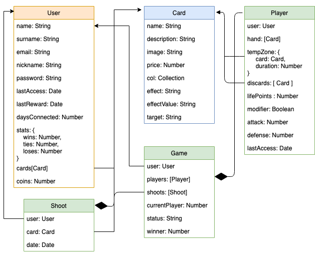

# Baam!

Wellcome to cards duel game. Baam is an strategy versus game. In Baam, you will collect and win new cards to complete your collection. Using your collection you will choose your favorite cards, to create an strategy and try to deffeat your oponent.

Let's figth!

## Functional Description

User starts on landign page. where can register, login, and read game description and rules.

First time user register and log, he will recieve a random initial welcoming amount of cards.

Once user is logged, will be able to get new cards, examine his cards collection, start a versus game, invite friends, see the game ranking, update his data, change password, and examine the different collections of cards.

when starting a game, the player choose a 6 cards hand from his collection. Cards type can't be repeat in the hand.

There are Attack, Defending, Blocking and Healthing types of cards.

    * Play Rules:
        * Every Player starts with 5 life points and 6 cards hand
        * One card is played per turn
        * In the Hand, the player can't choose 2 cards with same effect
        * The game ends when a player runs out of cards or life points
        * Every player has a temporary card zone where can play one card that perdures X turns, acordding to he card description
        * The Winner, can choose between keep a rival's card or earn coins
        * If choose earn coins, will earn 1 coin per life point left
        * The Looser, will lose the choosen card by opponent or 3 coins.
        * Coins are used to get new cards
        * If the 6 cards of your hand, pertains to the same collection, earned coins at the end of game will duplicate.

To make more interesting the game, user will recieve diary rewards. On every consecutive daily connection, this rewards will upgrade.

### Use Cases
 

### Activities

## Technical Description

### Data Model

### API Coverage

## TODO

- Design diferent collections appeareance
- Implement Sabotaje Cards
- Implement Handicap
- Collect Weekly rewards
- Let Tief a card to the opopent when win the game
- Ranking
- Add friends to play with